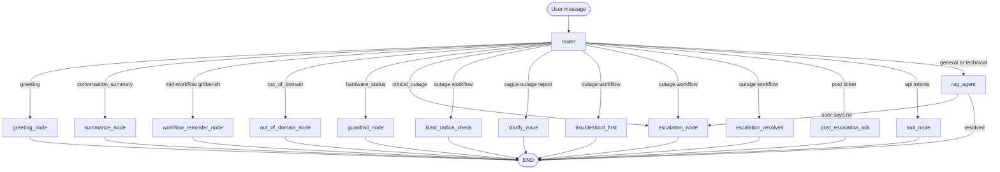

# Architecture

How the Operator Agent is structured at runtime and inside LangGraph.

**Last verified against code:** July 2026

---

## System context

```mermaid
flowchart LR
  streamlit[Streamlit app.py]
  react[React QA UAT]
  dotnet[NET Super Admin prod]
  agentAPI[FastAPI server.py :8000]
  graph[LangGraph agent_app]
  chroma[ChromaDB]
  setomatic[Setomatic APIs live]
  mock[mock_server.py :8001 refunds]
  notify[Mandrill and Twilio]

  streamlit -->|"in-process"| graph
  react --> agentAPI
  dotnet --> agentAPI
  agentAPI --> graph
  graph --> chroma
  graph --> setomatic
  graph --> mock
  graph --> notify
```

### Two servers, two roles

| Port | Service | Role |
|------|---------|------|
| **8000** | [src/api/server.py](../src/api/server.py) | **Agent API** — LangGraph chat for all UIs |
| **8001** | [src/api/mock_server.py](../src/api/mock_server.py) | **Mock Setomatic refunds** — used when `USE_MOCK_REFUNDS=true` |

Port 8001 is **not** a second agent server. Only **refund** tools (`check_refund_eligibility`, `execute_refund`) call `:8001` when mock mode is on.

**Note:** `mock_server.py` also exposes `/api/v1/loyalty/balance` and `/api/v1/transactions/lookup`, but [tools.py](../src/agent/tools.py) does **not** use them — loyalty and transaction tools always call live `SETOMATIC_BASE_URL`.

### Target state (production)

All UIs call **only** `:8000/api/v1/agent/chat`. Mock server replaced by live Setomatic refund APIs (`RefundEligibility` + `RefundProcessing`) in UAT/prod (`USE_MOCK_REFUNDS=false`). Full API scope: 4 core APIs (2 done, 2 blocked on backend) — see [SETOMATIC_BACKEND_APIS.md](SETOMATIC_BACKEND_APIS.md).

---

## LangGraph overview

- **Entry:** `router` (`semantic_router` in [router.py](../src/agent/router.py))
- **Checkpointer:** `MemorySaver` — in-process, keyed by `session_id` / `thread_id`
- **Compiled singleton:** `agent_app` in [graph.py](../src/agent/graph.py)



---

## Graph nodes (16 + router)

| Node | File | Purpose |
|------|------|---------|
| `router` | [router.py](../src/agent/router.py) | Classify intent, extract entities, set flags |
| `greeting_node` | [nodes.py](../src/agent/nodes.py) | Friendly response for greetings, thanks, and goodbyes (no RAG) |
| `summarize_node` | [nodes.py](../src/agent/nodes.py) | Operator-friendly conversation recap on demand |
| `workflow_reminder_node` | [nodes.py](../src/agent/nodes.py) | Re-prompts Yes/No when user sends gibberish mid-outage-workflow |
| `guardrail_node` | [nodes.py](../src/agent/nodes.py) | Refuse live hardware status requests |
| `pci_guardrail_node` | [nodes.py](../src/agent/nodes.py) | Static refusal for CVV/CVC/track-data requests |
| `out_of_domain_node` | [nodes.py](../src/agent/nodes.py) | Static refusal for off-topic / injection |
| `blast_radius_check` | [graph.py](../src/agent/graph.py) | Ask one machine vs entire laundromat |
| `clarify_issue` | [graph.py](../src/agent/graph.py) | Ask for symptom details when outage report is too vague |
| `troubleshoot_first` | [graph.py](../src/agent/graph.py) | RAG KB steps + "Did this resolve?" |
| `escalation_node` | [graph.py](../src/agent/graph.py) | Email + SMS dispatch; sets `escalation_dispatched` |
| `escalation_resolved` | [graph.py](../src/agent/graph.py) | Polite close when issue fixed; full workflow state reset |
| `post_escalation_ack` | [graph.py](../src/agent/graph.py) | Ack after ticket sent; no workflow restart |
| `new_issue_after_escalation` | [graph.py](../src/agent/graph.py) | Fresh blast-radius cycle after prior ticket dispatch |
| `tool_node` | [graph.py](../src/agent/graph.py) | ReAct loop for Setomatic API tools |
| `rag_agent` | [nodes.py](../src/agent/nodes.py) | Standard KB Q&A (`retrieve_and_generate`) |

Each turn ends at `END` after one node chain (router → one downstream node → END), except router may route through conditional edges without visiting RAG+escalation in same turn for outage mid-flow.

---

## Session memory

| Source | Thread key | Notes |
|--------|------------|-------|
| API | `session_id` → `configurable.thread_id` | [server.py](../src/api/server.py) |
| Streamlit | UUID in `st.session_state` | [app.py](../app.py) |

**Limitations (MVP):**

- `MemorySaver` is **in-process only** — lost on server restart; not shared across API replicas
- Phase 3: PostgreSQL or Redis checkpointer ([ROADMAP.md](ROADMAP.md))

**Reducers** ([state.py](../src/agent/state.py)):

- `messages` — `add_messages` (append)
- `extracted_entities` — `merge_dicts` (preserve card numbers across refund turns)

---

## Routing priority (`route_after_classifier`)

1. `pci_sensitive_data` → PCI guardrail
2. `conversation_summary` → `summarize_node` (honored even mid-workflow; does not reset outage state)
3. **Workflow continuity guard**: if `out_of_domain`/`greeting` BUT `troubleshooting_done` or `blast_radius_asked` is active → `workflow_reminder_node` (re-prompts)
4. `greeting` → greeting_node (pre-LLM heuristic; no RAG or API call)
5. `out_of_domain` → refusal
6. `hardware_lookup_attempted` → guardrail
7. Post-escalation follow-ups → `post_escalation_ack` or `escalation_resolved` or `new_issue_after_escalation` (fresh cycle for new reports); API intents pass through
8. **Post-resolution closure**: "no" / "no thanks" after "Glad to hear..." → friendly close (not new workflow)
9. `critical_outage` → immediate escalation (skip troubleshoot; dedup guard prevents re-dispatch)
10. Outage workflow intents → blast-radius → **entire_location: immediate escalation** / single_machine: `clarify_issue` (if vague, once per cycle) → troubleshoot → escalate on failure
11. **Escalation dedup**: if `escalation_dispatched` is set, "no" routes to `post_escalation_ack` (no duplicate tickets)
12. `api_action_required` → tools (clears stale workflow flags on completion)
13. Default → RAG

Outage intents (`_ESCALATION_WORKFLOW_INTENTS` in graph):

- `emergency_store_down`, `machine_down`, `escalation_request`
- `machines_not_starting`, `multiple_machines_offline`

RAG-only intents (no outage workflow):

- `kiosk_not_responding`, `technical_support` — route directly to RAG for KB answers

---

## RAG path

**Today (MVP):**

1. Load **`.pdf` and `.docx` only** from local `KB/` (`.txt` files skipped — [rag_service.py](../src/services/rag_service.py))
2. Chunk: 500 chars, 50 overlap; metadata: brand, doc_type
3. Embed: HuggingFace `all-MiniLM-L6-v2`
4. Store: Chroma `./chroma_db` (single-node; not shared across replicas)
5. Retrieve: MMR, k=6, fetch_k=20
6. Generate: OpenAI via `RAG_OPENAI_MODEL`

**Target (production):**

- **SpyderWash Bible** (~500 pages, Brandon mail) replaces legacy multi-manual `KB/` as the sole text source
- **Operator videos** are not in RAG until transcript or link strategy is approved — agent cannot “watch” video files
- Bible PDF (+ optional video transcripts) on **Rackspace Cloud Files** → scheduled ingest job → **Qdrant** (shared index) → agent API on Rackspace

See [KB_AND_PLATFORM.md](KB_AND_PLATFORM.md) and ADR-013 in [DECISIONS.md](DECISIONS.md).

---

## Tool path

| Tool | Target | OperatorId |
|------|--------|--------------|
| `get_loyalty_balance` | Live `SETOMATIC_BASE_URL` | Hardcoded `4` (**agent-side fix**: pipe `operator_id` from ChatRequest) |
| `get_transaction_history` | Live `SETOMATIC_BASE_URL` | Hardcoded `LoggedInUserId=4`; `PageSize` from `count` (1–20); `isRefund` from `include_refunds`; card pre-validated via balance API; LC-prefix stripped |
| `check_refund_eligibility` | Mock or live per `USE_MOCK_REFUNDS` | Hardcoded `4` |
| `execute_refund` | Mock or live per `USE_MOCK_REFUNDS` | Hardcoded `4` |
| `check_global_system_status` | Web scrape setomaticsystems.com/status | N/A |

Refund mock endpoints on `:8001`:

- `GET /api/Transactions/RefundEligibility`
- `GET /api/Transactions/RefundProcessing`

---

## Escalation path

When `escalation_node` runs:

1. `_extract_escalation_context` — summary from **current** incident
2. `_format_conversation_for_email` — full transcript (PCI-masked on API input only)
3. `_resolve_operator_contact` — from API fields or defaults
4. `NotificationService.send_escalation` — Mandrill + Twilio when `USE_LIVE_NOTIFICATIONS=true`
5. Sets `escalation_dispatched: true` → API returns `requires_escalation: true`

Detail: [ESCALATION_WORKFLOW.md](ESCALATION_WORKFLOW.md)

---

## Entry points

| Entry | Invocation | Use |
|-------|------------|-----|
| [server.py](../src/api/server.py) | HTTP `invoke()` | **Production / QA** |
| [app.py](../app.py) | In-process `stream()` | Local demo; sidebar routing diagnostics persisted in `st.session_state.routing_diagnostics` |
| [main.py](../main.py) | HTTP `/query` or CLI | **Legacy** — avoid |

---

## Related documents

- [API.md](API.md) — REST contract
- [ESCALATION_WORKFLOW.md](ESCALATION_WORKFLOW.md) — outage workflow
- [INTENT_MATRIX.md](INTENT_MATRIX.md) — intent routing
- [TECH_STACK.md](TECH_STACK.md) — technology choices
- [KB_AND_PLATFORM.md](KB_AND_PLATFORM.md) — Bible, videos, Rackspace
- [BRANDON_KB_ADMIN.md](BRANDON_KB_ADMIN.md) — structured KB chunks vs router
- [CODEBASE.md](CODEBASE.md) — repo file map
