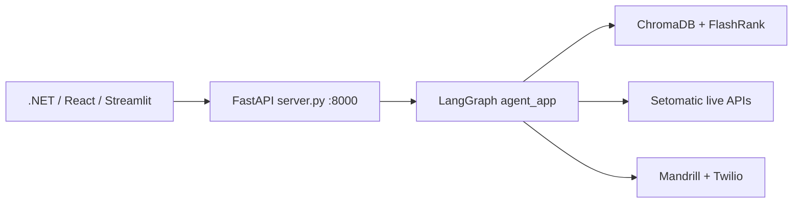
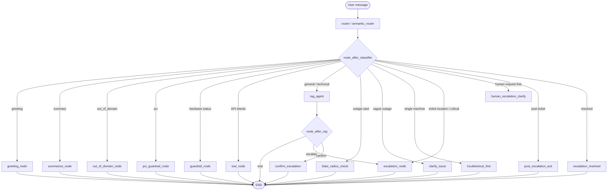

# Operator AI — Complete Code Flow & Function Reference

**Audience:** teammates onboarding to this repo  
**Language:** English  
**Last verified against code:** July 2026  

This document is a **shorter flow + function map**.

For the **full** new-developer guide (all files, variables, models, APIs, security, setup, troubleshooting), use:

→ **[COMPLETE_DEVELOPER_GUIDE.md](COMPLETE_DEVELOPER_GUIDE.md)**

> **Honest scope note:** A literal “line-by-line” dump of every source file (~5,000+ lines) is useless for learning. What teams need is **request flow + every function’s job + important constants/state**. That is what this doc is. For line-level reading, open the cited file and use this as the map.

---

## Table of contents

1. [What this project is](#1-what-this-project-is)
2. [End-to-end request flow](#2-end-to-end-request-flow)
3. [Repository map](#3-repository-map)
4. [Runtime architecture (Mermaid)](#4-runtime-architecture-mermaid)
5. [LangGraph node map](#5-langgraph-node-map)
6. [Module-by-module function reference](#6-module-by-module-function-reference)
7. [Multi-turn workflows (outage, tools, RAG)](#7-multi-turn-workflows-outage-tools-rag)
8. [How to run / test](#8-how-to-run--test)
9. [Where to change what](#9-where-to-change-what)

---

## 1. What this project is

**SpyderWash / Setomatic Operator AI** is a LangGraph-orchestrated technical support agent for laundromat operators.

| Capability | How it works |
|---|---|
| KB troubleshooting | RAG over v2.2 articles + selective Bible sections (ChromaDB + FlashRank) |
| Live data | Tools call Setomatic APIs (loyalty, transactions, kiosk, POS, remote device, reports, status) |
| Refunds | **Portal guidance only** via RAG — agent never executes refunds |
| Outages | Blast-radius → clarify → troubleshoot → confirm → escalate (email/SMS) |
| Guardrails | PCI (CVV/track), out-of-domain, no live hardware status |

**Frontends:**

| UI | How it talks to the agent |
|---|---|
| `.NET` (prod) | `POST /api/v1/agent/chat` on `server.py` |
| React (QA) | Same API |
| Streamlit (`app.py`) | In-process `agent_app.stream(...)` (dev demo) |

---

## 2. End-to-end request flow

### Production path (`server.py`)

```
Operator UI
    │
    ▼
POST /api/v1/agent/chat
    │  ChatRequest: operator_id, session_id, message, optional contact fields
    ▼
sanitize_user_text()          ← mask credit-card PANs (PCI)
    │
    ▼
compiled_graph.invoke(state, config={thread_id: session_id})
    │
    ├─ MemorySaver loads prior checkpoint for this session
    │
    ▼
┌─────────────────── LangGraph ───────────────────┐
│  ENTRY: router (semantic_router)                 │
│       │                                          │
│       ▼                                          │
│  route_after_classifier()  → one downstream node │
│       │                                          │
│       ├─ greeting / summarize / OOD / PCI / ... │
│       ├─ tool_node (ReAct loop, max 6)           │
│       ├─ rag_agent → optional route_after_rag    │
│       └─ outage workflow nodes                   │
│                                                  │
│  Most paths → END after one node                 │
└──────────────────────────────────────────────────┘
    │
    ▼
_extract_reply()              ← last non-empty AIMessage
    │
    ▼
ChatResponse { reply, detected_intent, requires_escalation }
```

### Streamlit path (`app.py`)

Same graph, but:

1. UI holds `thread_id` in `st.session_state`
2. Calls `compiled_graph.stream(...)` and shows live node labels
3. Persists a routing-diagnostics sidebar for debugging

### One-turn mental model

Almost every turn is:

```
User message → router classifies → ONE action node → END
```

Exceptions:

- `rag_agent` may continue via `route_after_rag` to escalation / confirm / END
- `new_issue_after_escalation` has a conditional edge into blast / troubleshoot / escalate
- `tool_node` runs an **internal** ReAct loop (LLM ↔ tools) before returning

---

## 3. Repository map

```
operator-AI/
├── app.py                      # Streamlit demo UI
├── main.py                     # Legacy CLI / old FastAPI harness — avoid for prod
├── pyproject.toml              # uv dependencies
├── AGENTS.md                   # Agent-facing project rules
├── KB/                         # Source manuals (v2.2 + Bible DOCX)
├── chroma_db/                  # Generated vector DB (gitignored)
├── tests/
│   ├── test_outage_workflow.py
│   ├── test_security.py
│   └── test_bug_fixes.py
└── src/
    ├── config.py               # All env reads
    ├── llm.py                  # OpenAI / Groq chat model factory
    ├── agent/
    │   ├── state.py            # AgentState TypedDict + reducers
    │   ├── router.py           # Intent classifier (entry node)
    │   ├── nodes.py            # RAG, greeting, PCI, OOD, summary nodes
    │   ├── graph.py            # Graph wiring + outage/escalation nodes + routing
    │   └── tools.py            # @tool Setomatic API wrappers
    ├── api/
    │   ├── server.py           # Production FastAPI
    │   ├── routes.py           # Legacy /query, /notify/* — do not extend
    │   └── schemas.py          # Legacy Pydantic models
    ├── services/
    │   ├── rag_service.py      # Ingest + retrieve + generate
    │   └── notifications.py    # Twilio SMS + Mandrill email
    └── utils/
        └── security.py         # PCI masking / CVV block
```

---

## 4. Runtime architecture (Mermaid)





---

## 5. LangGraph node map

| Graph node name | Implementing function | File | Purpose |
|---|---|---|---|
| `router` | `semantic_router` | `router.py` | Classify intent, extract entities, set flags |
| `greeting_node` | `handle_greeting` | `nodes.py` | Static hi / thanks / bye; clears workflow flags |
| `summarize_node` | `summarize_conversation_node` | `nodes.py` | LLM recap of thread + ticket IDs |
| `workflow_reminder_node` | `workflow_reminder_node` | `nodes.py` | Re-ask Yes/No mid-outage |
| `out_of_domain_node` | `handle_out_of_domain` | `nodes.py` | Static off-topic refusal |
| `pci_guardrail_node` | `pci_guardrail_node` | `nodes.py` | Static CVV/track refusal |
| `guardrail_node` | `guardrail_node` | `nodes.py` | Refuse live machine/port status |
| `rag_agent` | `retrieve_and_generate` | `nodes.py` | KB Q&A + optional “Did this resolve?” |
| `tool_node` | `tool_node` | `graph.py` | ReAct loop over Setomatic tools |
| `blast_radius_check` | `blast_radius_check_node` | `graph.py` | Ask one machine vs whole store |
| `clarify_issue` | `clarify_issue_node` | `graph.py` | Ask for symptoms when report is vague |
| `troubleshoot_first` | `troubleshoot_first_node` | `graph.py` | RAG steps for outage + resolve prompt |
| `troubleshoot_success` | `troubleshoot_success_node` | `graph.py` | Ack when steps fixed the issue |
| `confirm_escalation` | `confirm_escalation_node` | `graph.py` | Ask permission before single-machine escalate |
| `escalation_declined` | `escalation_declined_node` | `graph.py` | Give contact info if operator says no |
| `exit_escalation_gate` | `exit_escalation_gate_node` | `graph.py` | Leave confirm gate → answer via RAG |
| `escalation_node` | `escalation_node` | `graph.py` | Create TKT + email/SMS |
| `escalation_resolved` | `escalation_resolved_node` | `graph.py` | Close ticket(s), threaded resolve mail |
| `post_escalation_ack` | `post_escalation_ack_node` | `graph.py` | Ack after ticket; notes / callback / dedup |
| `human_escalation_clarify` | `human_escalation_clarify_node` | `graph.py` | “What is the issue?” before human escalate |
| `new_issue_after_escalation` | `new_issue_after_escalation_node` | `graph.py` | Reset flags; start fresh outage cycle |

**Compiled singleton:** `agent_app = create_agent_graph()` at bottom of `graph.py`.

---

## 6. Module-by-module function reference

### 6.1 `src/config.py` — configuration

| Symbol | Role |
|---|---|
| `load_dotenv()` | Loads `.env` into process env at import time |
| `_env_str(name, default)` | Non-empty string env helper |
| `_env_bool(name, default)` | Parses true/1/yes vs false/0/no |
| `SETOMATIC_BASE_URL` | Live API base URL |
| `LLM_PROVIDER` / `OPENAI_MODEL` / `GROQ_MODEL` | Chat model selection |
| `OPENAI_EMBEDDING_MODEL` | Embedding model for Chroma |
| `USE_LIVE_NOTIFICATIONS` | `False` = mock email/SMS (log only) |
| Twilio + SMTP constants | Escalation credentials / destinations |

**Rule:** tools and services must import URLs/flags from here — never hardcode secrets or base URLs in tool bodies beyond path suffixes.

---

### 6.2 `src/llm.py` — chat model factory

| Function | What it does |
|---|---|
| `create_chat_model(*, temperature=0)` | Returns `ChatOpenAI` or `ChatGroq` based on `LLM_PROVIDER`. Raises `ValueError` for unknown providers. |

Used by: router, RAG, summary node, escalation summary, tool ReAct agent.

---

### 6.3 `src/agent/state.py` — shared graph state

| Symbol | What it does |
|---|---|
| `merge_dicts(old, new)` | LangGraph reducer: merges entity dicts so turn-2 updates do not wipe turn-1 entities (e.g. `card_number`) |
| `AgentState` | TypedDict for all graph fields |

**Field groups:**

| Fields | Meaning |
|---|---|
| `messages` | Chat history (`add_messages` append reducer) |
| `current_intent`, `hardware_lookup_attempted`, `escalation_required`, `api_action_required` | Router outputs for routing |
| `blast_radius`, `troubleshooting_failed` | Outage workflow control |
| `escalation_dispatched`, `dispatched_tickets`, `all_session_tickets`, `ticket_email_ids` | Ticket lifecycle |
| `last_ticket_summary`, `last_ticket_blast_radius` | Duplicate-outage detection |
| `ticket_notes`, `callback_number` | Post-escalation operator extras |
| `operator_id/name/email/phone` | From API request for escalation mail |
| `extracted_entities` | Merged entity bag (card numbers, flags, dates, device IDs, …) |
| `context` | Legacy/optional context string |

---

### 6.4 `src/utils/security.py` — PCI helpers

| Function | What it does |
|---|---|
| `mask_credit_cards(text)` | Regex-masks Visa/MC/Amex PANs to `**-**-****-LAST4` |
| `contains_prohibited_card_auth_data(text)` | Detects CVV/CVC/track/PIN keywords or `cvv: 123` patterns |
| `sanitize_user_text(text)` | Ingress: mask PAN before graph/LLM |
| `sanitize_outbound_text(text)` | Egress: mask PAN in emails/SMS summaries |

**Constants:** `_VISA_MC_PATTERN`, `_AMEX_PATTERN`, `_PCI_AUTH_KEYWORDS`, `_CVV_VALUE_PATTERN`.

---

### 6.5 `src/api/server.py` — production API

| Symbol | What it does |
|---|---|
| `ChatRequest` | Pydantic: `operator_id`, `session_id`, `message`, optional contact |
| `ChatResponse` | Pydantic: `reply`, `detected_intent`, `requires_escalation` |
| `app` | FastAPI instance + CORS for SpyderWash + localhost |
| `telemetry_middleware` | Correlation ID, latency, SUCCESS/CLIENT_ERROR/SERVER_ERROR logs; warns >10s |
| `_extract_reply(graph_state)` | Walks messages backwards for last non-empty `AIMessage` (skips empty tool-call placeholders) |
| `chat(request)` | Sanitize → invoke graph with `thread_id=session_id` → build response |
| `health()` | Liveness `{status, service}` |

**Important:** `requires_escalation` is `escalation_dispatched`, not merely “escalation intent”.

---

### 6.6 `src/api/schemas.py` + `src/api/routes.py` — legacy (do not extend)

| Symbol | What it does |
|---|---|
| `QueryRequest` / `QueryResponse` / `NotificationRequest` | Old Pydantic models |
| `health_check` | Legacy health |
| `query_agent` | Old `/query` — invokes graph without session thread_id properly |
| `notify_sms` / `notify_email` | Direct notification endpoints — bypass graph; deprecated |

---

### 6.7 `src/agent/router.py` — intent classifier (entry node)

#### Helpers (pre-LLM short-circuits)

| Function | What it does |
|---|---|
| `_is_greeting(text)` | Exact/short greeting phrases → skip LLM |
| `_is_summary_request(text)` | “summarise / recap / tldr…” → summary intent |
| `_is_product_overview_query(text)` | “What is SpyderWash?” → force `general_query` (RAG) |
| `_is_show_more_request(text, messages)` | Detects pagination footer in prior AI + “show more” → keep API intent |
| `_normalize_typos(text)` | Light typo normalization for heuristics |
| `_is_resolution_message(text)` | Positive “fixed / resolved / working” language |
| `_assistant_in_active_outage_workflow(prior)` | Prior AI is mid outage prompts |
| `_is_fresh_outage_turn(intent, prior, entities)` | New outage in same session → clear stale troubleshooting flags |
| `_prior_is_blast_radius_question(prior)` | Prior asked one-vs-store → don’t treat leading “No” as failure |
| `infer_blast_radius(user_msg)` | Heuristic: `single_machine` vs `entire_location` from wording |
| `_contains_domain_keyword(text)` | Safety net: printer/portal/network/refund etc. override false OOD |

#### Schema / LLM

| Symbol | What it does |
|---|---|
| `IntentClassification` | Structured output: `intent`, three bool flags, `extracted_entities` |
| `_get_structured_llm()` | Lazy singleton: chat model + `with_structured_output(...)` |
| `SYSTEM_PROMPT` | Long classifier instructions (intent definitions, entity rules) |
| `semantic_router(state)` | **Main entry node** |

#### `semantic_router` step-by-step

1. Read latest user message  
2. If CVV/track → `pci_sensitive_data` (no LLM)  
3. If greeting / summary / product overview / show-more → short-circuit  
4. Build `[PRIOR ASSISTANT]` + `[CURRENT USER]` prompt  
5. Invoke structured LLM → `IntentClassification`  
6. Safety nets: domain keywords override OOD/greeting; recharge-failure → `technical_support`; offline reports → `machine_down` (not live status)  
7. Merge/clear entity flags for fresh outages  
8. Infer `blast_radius` if missing  
9. Return state update (`current_intent`, flags, entities, optional promoted `blast_radius` / `troubleshooting_failed`)

#### Intents the classifier may emit

`greeting`, `conversation_summary`, `general_query`, `technical_support`, `hardware_status`, `emergency_store_down`, `escalation_request`, `loyalty_balance_query`, `transaction_lookup`, `refund_request`, `system_status_check`, `kiosk_not_responding`, `machines_not_starting`, `multiple_machines_offline`, `out_of_domain`, `machine_down`, `critical_outage`, `kiosk_purchase_lookup`, `kiosk_recharge_lookup`, `pos_transaction_lookup`, `remote_device_action`, `report_lookup`, plus router-only `pci_sensitive_data`.

---

### 6.8 `src/agent/nodes.py` — RAG + static nodes

| Function | What it does |
|---|---|
| `get_rag_service()` | Lazy singleton `RAGService` |
| `_extract_metadata_filter(state)` | Build Chroma filter from `article_id` / brand / doc_type / intent→category |
| `_answer_contains_troubleshooting(answer)` | ≥2 troubleshooting markers → eligible for resolve prompt |
| `_get_prior_ai_content(messages)` | Prior AI text for follow-up expansion |
| `_is_short_followup(text)` | Short yes/ok/show me affirmatives |
| `_expand_followup_query(messages)` | Expand vague follow-up using prior AI / `KB-…` article id (ADR-036) |
| `retrieve_and_generate(state)` | RAG query → answer; maybe append “Did this resolve?” + set `troubleshooting_done` |
| `guardrail_node` | Refuse live hardware status |
| `pci_guardrail_node` | Refuse CVV/track |
| `handle_greeting` | Static greeting/thanks/bye; clears escalation/workflow flags |
| `workflow_reminder_node` | Re-prompt Yes/No |
| `handle_out_of_domain` | Static domain refusal |
| `summarize_conversation_node` | Build transcript + ticket system note → LLM summary |

**Maps used:** `_BRAND_FILTER_MAP`, `_INTENT_TO_CATEGORY_MAP`, `_TROUBLESHOOT_MARKERS`.

**Resolve-prompt rule (ADR-034/035):** append “Did this resolve?” only when answer looks like troubleshooting, and skip if the answer already ends with an offer question (“would you like me to…”).

---

### 6.9 `src/agent/graph.py` — orchestration + outage nodes

#### Helper utilities

| Function | What it does |
|---|---|
| `_is_conversational_workflow_reply(text)` | Short yes/no/scope replies vs real issue text |
| `_extract_escalation_context(messages)` | Pull human/AI context for summary |
| `_generate_escalation_summary(messages, blast_radius)` | LLM structured ISSUE/LOCATION/… summary |
| `_postprocess_summary(summary, blast_radius)` | Normalize summary lines |
| `_get_prior_assistant_content(messages)` | Prior AI content |
| `_user_indicates_resolved(text)` | Resolution phrasing |
| `_is_duplicate_outage(state, new_text)` | Jaccard similarity vs `last_ticket_summary` + blast-radius-aware dedup |
| `_is_howto_or_info_query(text)` | How-to / info → RAG after ticket |
| `_is_continuation_of_ticket(text)` | “also / additionally…” → ticket note |
| `_format_conversation_for_email(messages)` | Transcript for escalation payload |
| `_resolve_operator_contact(state)` | Name/email/phone with fallbacks |

#### Workflow / escalation nodes

| Function | What it does |
|---|---|
| `escalation_node` | Generate summary, create `TKT-…`, send email+SMS, update ticket lists |
| `new_issue_after_escalation_node` | Reset workflow entities; keep prior tickets; infer blast if possible |
| `_route_after_new_issue` | Chain to escalate / troubleshoot / blast_radius_check |
| `blast_radius_check_node` | Ask one machine vs entire laundromat; set `blast_radius_asked` |
| `clarify_issue_node` | Ask for symptoms; set `clarify_asked` |
| `troubleshoot_first_node` | RAG for outage + “Did this resolve?”; set `troubleshooting_done` |
| `escalation_resolved_node` | Resolve one/all tickets; threaded resolve email; multi-ticket disambiguation |
| `troubleshoot_success_node` | Celebrate fix; optional open-ticket reminder |
| `confirm_escalation_node` | “Would you like me to escalate?” for single machine |
| `escalation_declined_node` | Contact-support message when declined |
| `exit_escalation_gate_node` | Clear confirm gate; answer new question via RAG |
| `human_escalation_clarify_node` | Ask what issue is (ADR-031: bare human request ≠ store-down) |
| `post_escalation_ack_node` | Ticket already sent / notes / callback / status after dispatch |

#### Tool node

| Function | What it does |
|---|---|
| `_reset_tool_llm` / `_get_tool_llm` | Lazy ReAct LLM singleton |
| `tool_node(state)` | Bind tools → ReAct agent (max 6 iterations) → ensure every tool_call has ToolMessage → return final AI text |

**Bound tools:** loyalty, transactions, system status, kiosk purchases/recharges, POS, remote device, reports.

#### Routing

| Function | What it does |
|---|---|
| `route_after_classifier(state)` | Large priority switch → next node name string |
| `route_after_rag(state)` | After RAG: END, or escalate/confirm if answering prior resolve prompt with “no” |
| `create_agent_graph()` | Registers nodes, edges, MemorySaver; returns compiled app |

#### `route_after_classifier` priority (condensed)

1. PCI → `pci_guardrail`  
2. Conversation summary → `summarize`  
3. Escalation confirmation gate (yes/no/re-ask/exit)  
4. Ticket resolution disambiguation → `escalation_resolved`  
5. Mid-workflow gibberish → `workflow_reminder`  
6. Greeting (with blast override)  
7. Out of domain / hardware guardrail  
8. Post-escalation block (resolve / tools / new issue / howto RAG / ticket notes)  
9. Post-resolution closure (“glad to hear…”)  
10. Stateless resolution messages  
11. Human escalation clarify vs escalate  
12. Critical outage → escalate (or ack if already dispatched)  
13. Outage workflow: blast → entire_location escalate → clarify → troubleshoot → confirm/escalate/success  
14. Non-outage “Did this resolve?” follow-up  
15. Clarification-marker force RAG  
16. `api_action_required` → `tool`  
17. Default → `rag`

---

### 6.10 `src/agent/tools.py` — Setomatic API tools

#### Schemas (Pydantic args)

| Schema | Used by |
|---|---|
| `LoyaltyBalanceSchema` | `get_loyalty_balance` |
| `TransactionHistorySchema` | `get_transaction_history` (`count`, `include_refunds`, dates, `page_no`) |
| `KioskPurchasesSchema` | `get_kiosk_purchases` |
| `KioskRechargesSchema` | `get_kiosk_recharges` |
| `POSTransactionsSchema` | `get_pos_transactions` |
| `RemoteDeviceCommandSchema` | `send_remote_device_command` |
| `ReportSchema` | `get_report` |

#### Helpers

| Function | What it does |
|---|---|
| `_normalize_card_number` | Strip `LC-` prefix / whitespace |
| `_convert_date_to_api_format` | ISO → API date format |
| `_format_revenue_by_*` / `_format_attendant_detail` / `_format_promotional_fund` / `_format_pos_transactions_report` | Pretty-print report payloads |

#### Tools

| Tool | API / behavior |
|---|---|
| `get_loyalty_balance` | `GET .../CheckLoyaltyCardBalance` |
| `get_transaction_history` | Pre-validates card via balance API; `ViewAllTransactionSearch`; client pagination; default ~6-month window |
| `check_global_system_status` | Scrapes/public status page text for outage language |
| `get_kiosk_purchases` | Kiosk purchase history; local page slice |
| `get_kiosk_recharges` | Kiosk recharge history; local page slice |
| `get_pos_transactions` | POS tx history; local page slice |
| `send_remote_device_command` | Remote Dispense / Reboot for kiosk/device |
| `get_report` | Operator reports (revenue by location/position/machine/month, attendant, promo fund, POS) |

**Shared patterns in tools:**

1. Normalize / validate inputs via schema  
2. `requests.get/post` with timeouts  
3. Map 5xx → “system temporarily down”  
4. Map 4xx → surface API text  
5. Format operator-friendly string (hide internal transaction IDs from display where required)  
6. Catch connection/timeout/parse errors gracefully  

**Pagination:** APIs may return all rows; agent slices with `page_no` (default 5/page). “Show more” is detected in the router.

---

### 6.11 `src/services/rag_service.py` — knowledge retrieval

#### Module helpers

| Function | What it does |
|---|---|
| `_is_v22_file` / `_is_bible_file` | Filename detectors |
| `_parse_v22_articles(text)` | Split on `ARTICLE START/END`; return articles + Section 0 prompt + visual chunks (visuals excluded from index) |
| `_parse_bible_selective(text)` | Sections 1–14 + operator FAQ window; exclude brand wiring / RMA / PCI notes / voiceover |
| `_get_reranker` | Lazy FlashRank TinyBERT |
| `_rerank_documents(query, docs, top_k=6)` | Rerank MMR hits |

#### `RAGService` methods

| Method | What it does |
|---|---|
| `__init__` | Load existing Chroma or ingest KB; build MMR retriever; create LLM |
| `_load_section0_prompt` | Cache v2.2 Section 0 rules (prompt injection into generation, not as chunks) |
| `_find_v22_file` | Locate v2.2 DOCX in `KB/` |
| `load_and_process_documents` | Walk KB; route each file to v22 / bible / generic ingest |
| `_ingest_v22` / `_ingest_bible` / `_ingest_generic` | Per-source ingest |
| `initialize_vectorstore` | `Chroma.from_documents` persist |
| `_build_retriever` | MMR + optional metadata filter |
| `_fetch_co_retrieval_docs` | Pull companion `article_id`s from metadata |
| `_build_system_prompt` / `_condense_section0` | Generation system prompt |
| `query` | Public entry; retries without filter if filter returns empty |
| `_invoke_rag` | MMR → FlashRank → co-retrieve → stuff-docs chain → answer |

**Retrieval pipeline (as coded today):**

```
MMR (k=12, fetch_k=40, λ=0.5)
  → FlashRank top 6
  → co-retrieval companions
  → LLM with Section 0 rules + context
```

---

### 6.12 `src/services/notifications.py` — escalation dispatch

| Symbol | What it does |
|---|---|
| `EscalationResult` | `email_sent`, `sms_sent`, `message_id` |
| `NotificationService.send_sms` | Twilio or mock log |
| `send_email_html` | Mandrill SMTP HTML + optional Message-ID / In-Reply-To threading |
| `send_email` | Plain-text wrapper for legacy routes |
| `_parse_location_from_summary` | Extract `LOCATION:` line |
| `_build_escalation_html` | Branded HTML ticket email |
| `send_escalation` | Sanitize summary → email + SMS → `EscalationResult` |
| `send_resolution` | Threaded “RESOLVED” reply email + SMS |

`USE_LIVE_NOTIFICATIONS=false` (default) never hits Twilio/SMTP — safe for local/dev.

---

### 6.13 `app.py` — Streamlit demo

| Function | What it does |
|---|---|
| `_now_ts` / `_render_ts` | Chat bubble timestamps |
| `_node_label` | Map graph node → status UI text |
| `_extract_final_response` | Same last-AIMessage walk as API |
| `_render_routing_diagnostics` | Sidebar: intent, flags, entities, path |

Main script body: session state, chat history render, prompt handling, `compiled_graph.stream`, diagnostics persistence.

---

### 6.14 `main.py` — legacy harness

| Function | What it does |
|---|---|
| `stream_turn` | Streams one turn against graph for console testing |
| `run_multi_turn_test` | Scripted multi-turn demo |

Prefer `server.py` / `app.py` for real work.

---

### 6.15 Tests (what they protect)

| File | Focus |
|---|---|
| `tests/test_outage_workflow.py` | Blast radius, troubleshoot, escalate, post-escalation, dedup, greeting reset, follow-up expansion |
| `tests/test_security.py` | PAN masking, CVV detection |
| `tests/test_bug_fixes.py` | Regression cases for known bugs |

Run:

```bash
uv run python -m unittest tests.test_outage_workflow tests.test_security -v
```

---

## 7. Multi-turn workflows (outage, tools, RAG)

### 7.1 Outage / escalation (Gregg path)

```
machine_down / machines_not_starting / emergency_store_down / ...
        │
        ▼
blast_radius unknown? ──yes──► blast_radius_check ──► END (wait next turn)
        │ no
        ▼
entire_location? ──yes──► escalation_node (critical) ──► END
        │ no (single_machine)
        ▼
vague symptoms? ──yes──► clarify_issue ──► END
        │ no
        ▼
troubleshoot_first (RAG steps + Did this resolve?) ──► END
        │
        ├─ Yes  → troubleshoot_success
        └─ No   → confirm_escalation → (Yes) escalation_node
                                    → (No)  escalation_declined
```

**Critical rules:**

- `entire_location` skips troubleshoot  
- `single_machine` must confirm before ticket (alert fatigue control)  
- Bare “talk to a human” → `human_escalation_clarify` first (not auto store-down SMS)  
- Duplicate similar outage after ticket → `post_escalation_ack`, not second ticket  

### 7.2 Tool / API path

```
loyalty / transaction / kiosk / POS / remote / report / system_status
        │
        ▼
router sets api_action_required=True
        │
        ▼
tool_node ReAct (≤6):
   LLM decides tool + args
   → ToolMessage results
   → LLM may call again or summarize
        │
        ▼
END with operator-facing text
```

**Refund path is NOT tools:** `refund_request` must keep `api_action_required=false` and go to RAG (portal how-to).

### 7.3 RAG path

```
general_query / technical_support / refund_request / kiosk_not_responding / ...
        │
        ▼
retrieve_and_generate
  expand short follow-ups
  metadata filter (brand/category/article)
  RAGService.query
  maybe append Did this resolve?
        │
        ▼
route_after_rag → END or confirm/escalate
```

---

## 8. How to run / test

```bash
# deps
uv sync

# production API
uv run uvicorn src.api.server:app --host 0.0.0.0 --port 8000 --reload

# Streamlit demo
uv run streamlit run app.py

# tests
uv run python -m unittest tests.test_outage_workflow tests.test_security -v
```

After changing KB files: delete `chroma_db/` and restart so ingest rebuilds.

---

## 9. Where to change what

| You want to… | Edit… |
|---|---|
| Add a new intent | `IntentClassification` + `SYSTEM_PROMPT` in `router.py`; edge map in `route_after_classifier` / `create_agent_graph` |
| Change outage policy | `route_after_classifier` + nodes in `graph.py` |
| Add a live API capability | New `@tool` in `tools.py`; bind in `tool_node`; document in `SETOMATIC_BACKEND_APIS.md` |
| Change KB answer style | `RAGService._build_system_prompt` + Section 0 in v2.2 |
| Change ingest / retrieval | `rag_service.py` |
| Change API contract | `server.py` (`ChatRequest`/`ChatResponse`) + `docs/API.md` |
| Toggle live SMS/email | `.env` → `USE_LIVE_NOTIFICATIONS` |
| Switch LLM | `.env` → `LLM_PROVIDER` / models |

---

## Related docs

| Doc | Use when |
|---|---|
| [ARCHITECTURE.md](ARCHITECTURE.md) | High-level design |
| [ESCALATION_WORKFLOW.md](ESCALATION_WORKFLOW.md) | TC1/TC2 outage scenarios |
| [INTENT_MATRIX.md](INTENT_MATRIX.md) | Brandon matrix ↔ intents |
| [SETOMATIC_BACKEND_APIS.md](SETOMATIC_BACKEND_APIS.md) | Backend API scope |
| [DECISIONS.md](DECISIONS.md) | ADRs (why refunds are portal-only, etc.) |
| [CODEBASE.md](CODEBASE.md) | Short file map |
| [ONBOARDING.md](ONBOARDING.md) | New-dev tour |

---

## Quick “read order” for a new teammate

1. This file (flow + functions)  
2. `src/agent/state.py` (what memory looks like)  
3. `src/api/server.py` (HTTP boundary)  
4. `src/agent/router.py` → `semantic_router`  
5. `src/agent/graph.py` → `route_after_classifier` + `create_agent_graph`  
6. `src/agent/nodes.py` → `retrieve_and_generate`  
7. `src/agent/tools.py` (one tool end-to-end, e.g. loyalty)  
8. `src/services/rag_service.py` → `query` / `_invoke_rag`  
9. Run Streamlit and watch the routing diagnostics sidebar  

That path teaches the real system faster than reading every line in order.
