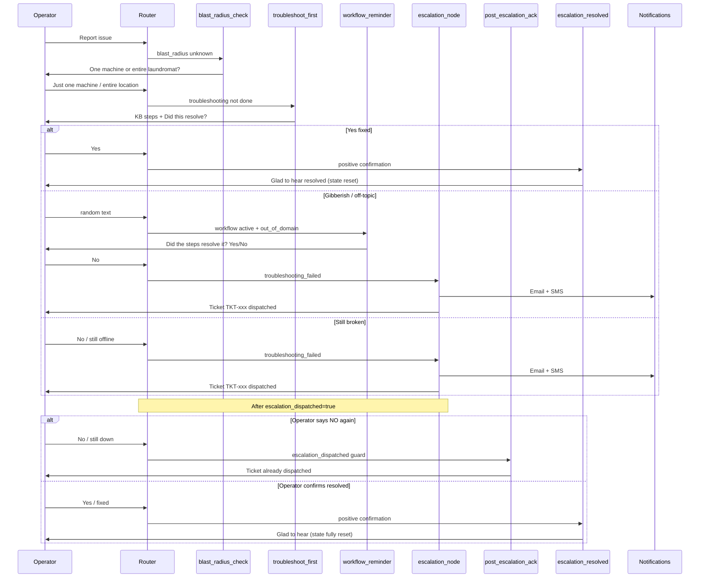

# Escalation Workflow

Gregg's required multi-turn outage workflow: **troubleshoot first → confirm → escalate only on failure**.

Implementation: [src/agent/graph.py](../src/agent/graph.py), [src/agent/router.py](../src/agent/router.py)

---

## Workflow diagram

---

## Intents that use this workflow

From `_ESCALATION_WORKFLOW_INTENTS` in [graph.py](../src/agent/graph.py) (same set as `_OUTAGE_WORKFLOW_INTENTS` in [router.py](../src/agent/router.py)):

| Intent | Typical operator message |
|--------|--------------------------|
| `machines_not_starting` | "My washer won't start" |
| `machine_down` | "Machine 5 is offline" |
| `kiosk_not_responding` | "Kiosk is frozen" |
| `multiple_machines_offline` | "Several machines lost hub connection" |
| `emergency_store_down` | "Whole store is down" |
| `escalation_request` | "I need a human / supervisor" |

**Exception:** `critical_outage` skips troubleshooting and escalates immediately.

---

## Step-by-step

### Step 1 — Blast-radius question

**Node:** `blast_radius_check_node`

**Prompt:** "To help me get you the right fix, is this affecting just one specific machine, or is your entire laundromat offline?"

**Router extracts:** `blast_radius`: `single_machine` or `entire_location`

**Heuristic fallback:** [infer_blast_radius](../src/agent/router.py) when LLM omits entity (e.g. "Everything is down" → `entire_location`).

### Step 2 — Troubleshooting (RAG)

**Node:** `troubleshoot_first_node`

- Builds query from original incident message (skips short replies like "yes", "no", "just one machine")
- **Entire location:** biases query toward hub/gateway/network KB content
- **Single machine:** filters `doc_type: troubleshooting_guide`
- Appends: "Did this resolve the issue? (Yes/No)"
- Sets `troubleshooting_done: true` in entities

### Step 3 — Confirmation routing

**Router continuation rules** detect replies to "Did this resolve?":

| Operator reply | Route |
|----------------|-------|
| yes / fixed / resolved | `escalation_resolved_node` |
| no / still down / still offline / not resolved / didn't work | `escalation_node` |
| gibberish / off-topic (while workflow active) | `workflow_reminder_node` (re-prompts Yes/No) |

Negative word/phrase matching also runs in `route_after_classifier` after `troubleshooting_done` is set. Includes common expressions like "not working", "same issue", "no luck", etc.

### Step 4 — Escalation dispatch

**Node:** `escalation_node`

1. `_extract_escalation_context` — summary from **current** incident (not stale TC1 messages)
2. `_format_conversation_for_email` — full transcript
3. `_resolve_operator_contact` — from API fields or "Unknown Operator"
4. `NotificationService.send_escalation` — Mandrill HTML email + Twilio SMS (both today; Brandon matrix targets per-intent channels — [INTENT_MATRIX.md](INTENT_MATRIX.md))
5. Sets `escalation_dispatched: true`

**Ticket format:** `TKT-{8 hex chars}`

**SMS format:** `SpyderWash ESCALATION TKT-xxx: {summary}`

### Step 5 — Post-escalation (deduplication guard)

Once `escalation_node` fires, `escalation_dispatched: true` is set in state. This flag prevents duplicate tickets:

- Any subsequent negative reply ("no", "still down") → `post_escalation_ack_node` (ticket already active)
- "resolved" / "fixed" → `escalation_resolved_node` (clears all workflow state)
- Gibberish / ambiguous → `workflow_reminder_node`

If assistant message contains "critical escalation ticket" or "already been dispatched":

- "wait yes" / ambiguous follow-up → `post_escalation_ack_node` (no blast-radius restart)
- "resolved" / "fixed" → `escalation_resolved_node`

### Step 6 — State reset on resolution

`escalation_resolved_node` clears all workflow flags (`troubleshooting_done`, `blast_radius`, `escalation_dispatched`, `troubleshooting_failed`) so subsequent messages are treated as fresh conversations — not trapped in the completed workflow's state.

---

## Gregg test cases

### TC1 — Happy path (no escalation)

| Turn | Operator says | Expected |
|------|---------------|----------|
| 1 | My washer won't start. | Blast-radius question |
| 2 | Just one machine. | KB troubleshooting + "Did this resolve?" |
| 3 | Yes, that fixed it. | "Glad to hear..." — **no** email/SMS |

### TC2 — Troubleshoot then escalate (same session as TC1)

| Turn | Operator says | Expected |
|------|---------------|----------|
| 4 | Everything is down at the Chetu Test Location! | KB hub steps + "Did this resolve?" (not blast-radius again) |
| 5 | No, gateway still offline. | Ticket dispatched; summary mentions **current** outage |

### Post-escalation

| Turn | Operator says | Expected |
|------|---------------|----------|
| 6 | wait yes | Ticket already dispatched ack |
| 7 | the issue resolved bro | Glad to hear resolved |

Automated tests: [tests/test_outage_workflow.py](../tests/test_outage_workflow.py)

---

## Edge cases handled in code

| Issue | Fix |
|-------|-----|
| `machines_not_starting` skipped workflow | Routed through `_ESCALATION_WORKFLOW_INTENTS` |
| Stale `troubleshooting_done` from TC1 broke TC2 | Fresh outage turn resets state in router |
| Word "down" in outage report triggered early escalation | Requires `troubleshooting_done` before negative-word escalation |
| Ticket summary used wrong incident | `_extract_escalation_context` walks recent messages |
| Entire-location RAG returned single-machine power steps | Hub/gateway query bias in `troubleshoot_first_node` |
| Post-escalation "wait yes" restarted blast-radius | `post_escalation_ack_node` |
| Gibberish mid-workflow broke "Did this resolve?" flow | `workflow_reminder_node` re-prompts; `_is_fresh_outage_turn` respects active state |
| "No" after interruption restarted blast-radius | `_is_fresh_outage_turn` checks `existing_entities.troubleshooting_done` |
| Operator keeps saying "NO" to generate infinite tickets | `escalation_dispatched` flag gates re-escalation; routes to `post_escalation_ack` |
| "MACHINE DONW" after "YES" stuck in workflow_reminder | `escalation_resolved_node` resets all workflow flags so new issues start fresh |
| "no" after "Glad to hear..." starts new workflow | Post-resolution closure guard detects conversational "no" (≤5 words) and routes to friendly close |
| Gibberish during blast-radius question advances workflow | `blast_radius_asked` flag + heuristic-only validation; LLM-hallucinated entities ignored |

---

## Notification configuration

| Variable | Purpose |
|----------|---------|
| `USE_LIVE_NOTIFICATIONS` | `false` = log only; `true` = send |
| `ESCALATION_EMAIL` | Mandrill recipient (support team) |
| `ESCALATION_SMS_TO` | Twilio on-call number |
| Operator fields on API request | Appear in email template body |

Email template: HTML in [notifications.py](../src/services/notifications.py) `_build_escalation_html`.

**Current behavior:** Every escalation sends **both** email and SMS.

**Target (Brandon matrix, Phase 2):** SMS-only for Entire Store Down; Email-only for receipt printer and conditional rows; Email/SMS for kiosk and machines-not-starting. See [INTENT_MATRIX.md](INTENT_MATRIX.md).

---

## Related documents

- [PRD.md](PRD.md) — acceptance criteria
- [TESTING.md](TESTING.md) — manual and automated tests
- [API.md](API.md) — `requires_escalation` flag
