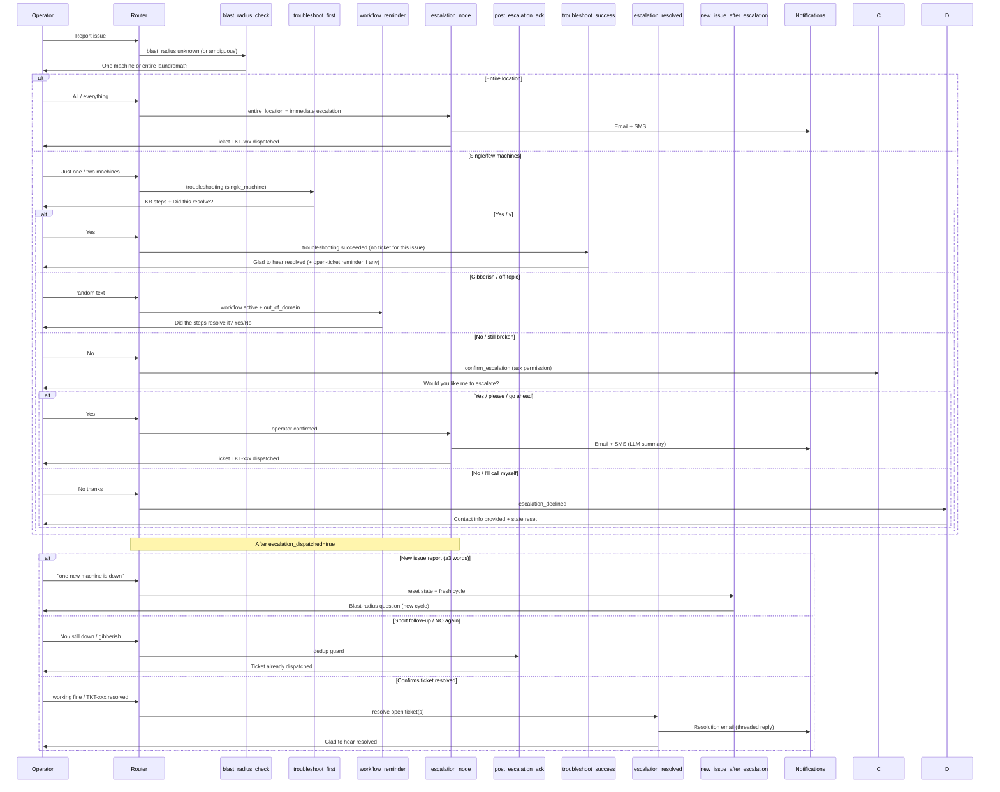

# Escalation Workflow

Gregg's required multi-turn outage workflow: **troubleshoot first → confirm → escalate only on failure**.

Implementation: [src/agent/graph.py](../src/agent/graph.py), [src/agent/router.py](../src/agent/router.py)

---

## Workflow diagram

---

## Intents that use this workflow

From `_ESCALATION_WORKFLOW_INTENTS` in [graph.py](../src/agent/graph.py) (same set as `_OUTAGE_WORKFLOW_INTENTS` in [router.py](../src/agent/router.py)):

| Intent | Typical operator message |
|--------|--------------------------|
| `machines_not_starting` | "My washer won't start" |
| `machine_down` | "Machine 5 is offline" |
| `multiple_machines_offline` | "Several machines lost hub connection" |
| `emergency_store_down` | "Whole store is down" |

**Not in this set:** `escalation_request` ("I need a human") uses clarify-first → escalate (ADR-031), not blast-radius.

**Exceptions:**
- `critical_outage` skips troubleshooting and escalates immediately.
- `entire_location` blast radius also escalates immediately (entire laundromat offline = critical).

---

## Step-by-step

### Step 1 — Blast-radius question (conditional)

**Node:** `blast_radius_check_node`

**Prompt:** "To help me get you the right fix, is this affecting just one specific machine, or is your entire laundromat offline?"

**Skipped when:** the user's initial message already contains a clear blast-radius indicator (e.g., "one machine is down" → inferred as `single_machine` by heuristic, skips the question).

**Router extracts:** `blast_radius`: `single_machine` or `entire_location`

**Heuristic fallback:** [infer_blast_radius](../src/agent/router.py) — expanded to cover:
- Single: "one machine", "two machines", "few machines", "a machine", short answers like "one", "1"
- Entire: "all machines", "everything down", "whole store", short answers like "all", "everything"

### Step 2a — Entire location → Immediate escalation

If `blast_radius == "entire_location"`: **skip troubleshooting** and route to `escalation_node` directly. The entire laundromat being offline is inherently critical and requires immediate human intervention.

### Step 2b — Single/few machines → Troubleshooting (RAG)

**Node:** `troubleshoot_first_node`

- Builds query from original incident message (skips short replies like "yes", "no", "just one machine")
- Filters `doc_type: troubleshooting_guide`
- Appends: "Did this resolve the issue? (Yes/No)"
- Sets `troubleshooting_done: true` in entities
- Does **not** include source citations in the response (PM decision: Sources line removed)

### Step 3 — Confirmation routing (tiered)

**Router continuation rules** detect replies to "Did this resolve?":

| Operator reply | Blast radius | Route |
|----------------|-------------|-------|
| yes / fixed / resolved | any | `troubleshoot_success_node` (not ticket resolve) |
| no / still down / didn't work | `entire_location` | `escalation_node` (auto-escalate) |
| no / still down / didn't work | `single_machine` | `confirm_escalation_node` (ask first) |
| gibberish / off-topic (while workflow active) | any | `workflow_reminder_node` (re-prompts Yes/No) |

**Important:** "Yes" after "Did this resolve the issue?" means **troubleshooting succeeded for the current issue** — no ticket was created for that cycle. Route to `troubleshoot_success_node`, which says "Glad to hear..." and, if prior escalations left open tickets, appends a reminder listing them. Do **not** jump straight to "Which ticket is resolved?"

**Tiered escalation rationale:** Entire-location outages are inherently critical and auto-escalate. Single-machine failures are routine — the operator may prefer to call support directly or try their own fix. Asking for confirmation prevents alert fatigue (email pile-up).

### Step 3b — Escalation confirmation (single-machine only)

**Node:** `confirm_escalation_node`

**Prompt:** "I wasn't able to resolve this with the troubleshooting steps available. Would you like me to escalate this to the on-call technician, or would you prefer to contact support directly at Support@setomaticsystems.com / (516) 990-4055?"

Sets `escalation_confirmation_asked: true` in entities.

| Operator reply | Route |
|----------------|-------|
| yes / please / go ahead / escalate | `escalation_node` |
| no / no thanks / I'll call | `escalation_declined_node` (provides contact info, resets state) |
| gibberish / ambiguous | Re-prompt via `confirm_escalation_node` |

### Step 4 — Escalation dispatch

**Node:** `escalation_node`

1. `_generate_escalation_summary` — LLM-generated structured technical handoff summary (Issue, Equipment, Location, Steps Attempted, Outcome, Severity). Falls back to heuristic `_extract_escalation_context` if LLM call fails.
2. Incident window is bounded by markers including `"escalation ticket"` (matches both critical and standard ticket messages) so STEPS from a prior incident do not bleed into the new ticket.
3. `_format_conversation_for_email` — full transcript (sanitized, PCI-masked)
4. `_resolve_operator_contact` — from API fields (conditional: only rendered in email when real data available)
5. `NotificationService.send_escalation` — Professional HTML email + Twilio SMS; returns `message_id` for threading
6. Sets `escalation_dispatched: true`; appends ticket to `dispatched_tickets` (open) and `all_session_tickets` (append-only); stores email Message-ID in `ticket_email_ids`

**Ticket format:** `TKT-{8 hex chars}`

**Email subject:** `[CRITICAL] SpyderWash Escalation TKT-xxx` or `[STANDARD] SpyderWash Escalation TKT-xxx`

**Email structure:**
- Header: ticket ID, timestamp, severity badge (CRITICAL = red, STANDARD = orange)
- Technical Summary: LLM-generated structured summary (Issue, Equipment, Location, Steps, Outcome, Severity)
- Operator Contact: conditional — only shown when portal sends real operator data
- Full Transcript: complete conversation history (sanitized)

**SMS format:** `SpyderWash [SEVERITY] TKT-xxx: {issue line}`

### Step 5 — Post-escalation (deduplication + fresh cycle)

Once `escalation_node` fires, `escalation_dispatched: true` is set in state. This flag prevents duplicate tickets:

- Any subsequent negative reply ("no", "still down") → `post_escalation_ack_node` (ticket already active)
- Resolution phrases ("working fine", "issue resolved") or a bare `TKT-…` ID → `escalation_resolved_node`
- Gibberish / ambiguous → `post_escalation_ack_node`
- Substantive non-outage queries (e.g. "what is SpyderWash") → RAG / normal nodes (passthrough)
- **New issue report** (outage intent + ≥3 words) → `new_issue_after_escalation_node` (resets workflow flags, starts fresh cycle)

If assistant message contains `"escalation ticket"` or `"already been dispatched"`:

- Short follow-up / ambiguous → `post_escalation_ack_node` (no blast-radius restart)
- Resolution language / ticket ID → `escalation_resolved_node`
- New descriptive issue report → fresh cycle

### Step 6 — Ticket resolution (multi-ticket aware)

**Node:** `escalation_resolved_node`

Used when the operator confirms an **escalated ticket** is fixed (not when KB troubleshooting alone fixed the issue).

| Situation | Behavior |
|-----------|----------|
| Multiple open tickets, no ID / no "all" | Ask: "Which ticket is resolved?" (list open tickets) |
| Specific `TKT-…` in open list | Resolve that ticket; send threaded resolution email; remove from `dispatched_tickets` |
| Specific `TKT-…` **not** in open list | Warn "already resolved / not open" — do **not** bulk-resolve remaining tickets |
| Single open ticket, or operator says "all" | Resolve remaining open ticket(s); send resolution email(s) |

Resolution emails use `In-Reply-To` / `References` from `ticket_email_ids` so they thread under the original escalation.

### Step 7 — Troubleshoot success (no ticket for current issue)

**Node:** `troubleshoot_success_node`

After "Did this resolve?" → Yes:

1. Reply: "Glad to hear the issue is resolved!…"
2. If `dispatched_tickets` is non-empty, append: "You still have the following open tickets…" and invite the operator to name a ticket ID
3. Does **not** call `send_resolution` or remove tickets

### Conversation summary tickets

`summarize_conversation_node` injects `all_session_tickets` (append-only) with OPEN/RESOLVED status derived from `dispatched_tickets`, so summaries include every ticket created in the session without duplicates/omissions.

---

## Gregg test cases

### TC1 — Happy path (no escalation)

| Turn | Operator says | Expected |
|------|---------------|----------|
| 1 | My washer won't start. | Blast-radius question |
| 2 | Just one machine. | KB troubleshooting + "Did this resolve?" |
| 3 | Yes, that fixed it. | "Glad to hear..." via `troubleshoot_success` — **no** email/SMS |

### TC2 — Troubleshoot then escalate (same session as TC1)

| Turn | Operator says | Expected |
|------|---------------|----------|
| 4 | Everything is down at the Chetu Test Location! | KB hub steps + "Did this resolve?" (not blast-radius again) |
| 5 | No, gateway still offline. | Ticket dispatched; summary mentions **current** outage |

### Post-escalation

| Turn | Operator says | Expected |
|------|---------------|----------|
| 6 | wait yes | Ticket already dispatched ack |
| 7 | the issue resolved bro | Glad to hear resolved |

Automated tests: [tests/test_outage_workflow.py](../tests/test_outage_workflow.py)

---

## Edge cases handled in code

| Issue | Fix |
|-------|-----|
| `machines_not_starting` skipped workflow | Routed through `_ESCALATION_WORKFLOW_INTENTS` |
| Stale `troubleshooting_done` from TC1 broke TC2 | Fresh outage turn resets state in router |
| Word "down" in outage report triggered early escalation | Requires `troubleshooting_done` before negative-word escalation |
| Ticket summary used wrong incident | `_extract_escalation_context` walks recent messages |
| Entire-location RAG returned single-machine power steps | Hub/gateway query bias in `troubleshoot_first_node` |
| Post-escalation "wait yes" restarted blast-radius | `post_escalation_ack_node` |
| Gibberish mid-workflow broke "Did this resolve?" flow | `workflow_reminder_node` re-prompts; `_is_fresh_outage_turn` respects active state |
| "No" after interruption restarted blast-radius | `_is_fresh_outage_turn` checks `existing_entities.troubleshooting_done` |
| Operator keeps saying "NO" to generate infinite tickets | `escalation_dispatched` flag gates re-escalation; routes to `post_escalation_ack` |
| "MACHINE DONW" after "YES" stuck in workflow_reminder | `escalation_resolved_node` resets all workflow flags so new issues start fresh |
| "no" after "Glad to hear..." starts new workflow | Post-resolution closure guard detects conversational "no" (≤5 words) and routes to friendly close |
| Gibberish during blast-radius question advances workflow | `blast_radius_asked` flag + heuristic-only validation; LLM-hallucinated entities ignored |
| "every" / "each" not recognized as entire_location | Added to `_ENTIRE_SHORT` set |
| "yaa" not recognized as positive confirmation | Added to `_positive_words` set |
| API tool call during active workflow causes state leak | `tool_node` clears all workflow flags on execution |
| "one machine is down" during "Did this resolve?" triggers false escalation | New-issue detection (≥4 words + machine terms) routes to fresh `blast_radius_check` |
| "one machine" alone (no symptom) goes straight to troubleshooting | `clarify_issue_node` asks for details when issue description lacks action/symptom words |
| "one machine is down" triggers unnecessary clarify question | Message selection now accepts messages containing action words (down/offline/etc.) even if they match `_is_conversational_workflow_reply` patterns |
| Workflow_reminder fires after escalation (cycle complete) | Guard checks `not state.get("escalation_dispatched")` |
| `escalation_node` doesn't mark workflow done | Now sets `troubleshooting_done: True`, `blast_radius_asked: False` |
| Non-outage symptoms (lights/sounds) enter outage workflow | Router prompt rule 15: `technical_support` for symptoms → RAG directly (no blast-radius/escalation) |
| Router overwrites `blast_radius: None` destroying established scope | Router only writes blast_radius to state when non-None |
| `clarify_issue` fires repeatedly (user provides details but gets re-asked) | `clarify_asked` flag ensures clarify only fires once per cycle |
| "lc-00000212" card number fails but "00000212" works | `_normalize_card_number()` strips LC-/lc- prefixes in tools before API call |
| "summarise this chat" mid-workflow ignored or breaks outage state | `conversation_summary` routed early to `summarize_node`; workflow flags preserved |
| Streamlit sidebar diagnostics flash then disappear | `routing_diagnostics` persisted in `st.session_state`; rendered on every run |
| "Yes" after troubleshoot asks "Which ticket?" when open tickets exist | `troubleshoot_success_node` acknowledges first; open-ticket reminder is secondary |
| Escalation email STEPS from prior incident | Boundary marker is `"escalation ticket"` (covers standard + critical wording) |
| Resolving already-resolved TKT bulk-closes others | Guard when ticket ID not in `dispatched_tickets` |
| Summary drops/duplicates ticket IDs | `all_session_tickets` append-only list + OPEN/RESOLVED in summary system note |
| Resolution phrases create new tickets | Stateless resolution guard + `infer_blast_radius` bails on resolution language |

---

## Notification configuration

| Variable | Purpose |
|----------|---------|
| `USE_LIVE_NOTIFICATIONS` | `false` = log only; `true` = send |
| `ESCALATION_EMAIL` | Mandrill recipient (support team) |
| `ESCALATION_SMS_TO` | Twilio on-call number |
| Operator fields on API request | Appear in email template body |

Email template: HTML in [notifications.py](../src/services/notifications.py) `_build_escalation_html`.

**Current behavior:** Every escalation sends **both** email and SMS.

**Target (Brandon matrix, Phase 2):** SMS-only for Entire Store Down; Email-only for receipt printer and conditional rows; Email/SMS for kiosk and machines-not-starting. See [INTENT_MATRIX.md](INTENT_MATRIX.md).

---

## Related documents

- [PRD.md](PRD.md) — acceptance criteria
- [TESTING.md](TESTING.md) — manual and automated tests
- [API.md](API.md) — `requires_escalation` flag
